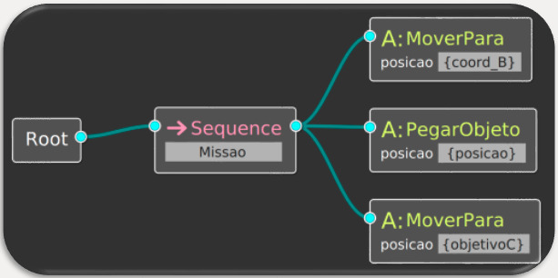
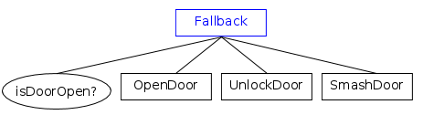

# behavior_tree_tutorials

A Behavior Tree (ou Árvore de Comportamento) é um modelo para estruturar tomadas de decisão (Task Switching Structure), criado inicialmente para a área de robótica, mas também amplamente utilizado na indústria de jogos, para desenvolvimento da Inteligência Artificial das entidades dos games. 

## Vantagens da Behavior Tree
Dentre as vantagens de se utilizar uma árvore de comportamento em comparação a outros métodos de Task Switching Structure (como a Máquina de Estados, por exemplo), estão:  

- **Hierarquia:** Podemos criar quantas subárvores quisermos, detalhando o sistema; 
- **Modularidade:** Há pouca ou nenhuma dependência entre os componentes (subárvores, e folhas), de forma que eles podem ser utilizados e reaproveitados para diferentes aplicações; 
- **Flexibilidade:** Com a Árvore de Comportamentos, pode-se facilmente adicionar, retirar ou modificar Nós e Subárvores, tornando o sistema bastante flexível e maleável; 
- **Representação gráfica:** Todo o comportamento pode ser facilmente representado de forma gráfica, em uma estrutura de árvore, em que cada subárvore representa um “galho” da árvore principal, e cada Ação a ser tomada representa uma “folha” dessa árvore. Isso torna a Behavior Tree um método de simples compreensão e fácil desenvolvimento. 

Posteriormente será realizada uma comparação entre a Behavior Tree (BT) e a Finite State Machine (FSM), tornando essas vantagens mais evidentes.

## Exemplo prático
Podemos tomar como exemplo um robô, que tenha por objetivo ir de um ponto A até um ponto B, pegar um objeto, e então entregá-lo em um ponto C. Assim, esta seria uma Árvore de Comportamento simplificada para executar esse objetivo: 

Entretanto, precisamos fazer com que o robô pegue o objeto. Podemos então criar uma subárvore, que especifica como realizar essa tarefa: primeiro, abra o seu gripper, então aproxime-se do objeto e, finalmente, feche seu gripper, para segurá-lo. Com essa subárvore, a estrutura da árvore seria a seguinte: 

Percebe-se que, ao utilizar a Árvore de Comportamentos, podemos detalhar cada uma das ações a serem executadas, e isso nos faz sempre pensar em todas as possiblidades. Note também que, através da representação gráfica, todo o sistema torna-se de fácil entendimento. Além disso, a subárvore responsável por pegar o objeto pode facilmente ser utilizada em outros projetos, e podemos também adicionar, retirar, ou modificar Nós e Subárvores da forma que quisermos, tornando as Behavior Trees bastante flexíveis. 

## Funcionamento
A Behavior Tree baseia-se em nós, os TreeNodes. QUando rodamos um TreeNode, ele nos retornará um TreeStatus, que podem ser:
- **SUCCESS:** operação bem sucedida
- **FAILURE:** operação mal sucedida
- **RUNNING:** retornado por nós assíncronos, sua execução ainda não está comlpeta, precisa de mais tempo para retornar um resultado de sucesso ou falha

Existem 4 tipos de TreeNode:
- **ControlNodes**
- **DecoratorNodes:** 
- **ActionNodes:** 
- **ConditioNodes:** 
  
### ControlNodes
Nós de Controle possuem um ou mais nós filhos. Quando ele é executado (dizemos que foi feito um “tick”), ele propaga essa execução (o "tick") para seus Nós filhos (os que estão abaixo dele na hierarquia), e retorna o valor RUNNING enquanto esses filhos ainda estiverem sendo executados. Existem dois tipos principais de Nós de Controle, determinado de acordo com a forma que se deseja controlar os Nós Filhos: 

#### SequenceNodes

Os filhos desse Nó de Controle serão sempre executados em ordem (na representação gráfica acima, da esquerda para a direita), de forma que:  
1. Quando um filho for executado, se ele retornar SUCCESS, o próximo filho será executado;  
2. Se o filho, ao invés disso, retornar FAILURE, nenhum outro filho será executado, a Sequência será encerrada e retornará FAILURE;
3. Se a sequência chegar até o último filho, e ele retornar SUCCESS, a Sequência será encerrada e retornará SUCCESS; 

Dentro dos SequenceNodes, há ainda 3 subcategorias:

|                      | Filho retorna FAILURE | Filho retorna RUNNING |
|----------------------|:---------------------:|:---------------------:|
| **Sequence**         | Restart               | Tick Again            |
| **ReactiveSequence** | Restart               | Restart               |
| **SequenceStar**     | Tick Again            | Tick Again            |

_"Restart"_ significa que, da próxima vez que a Sequência receber um tick, todos os Nós Filhos receberão um tick (serão executados) em ordem, inclusive aqueles que já retornaram SUCCESS no tick anterior
_"Tick Again"_ significa que, da próxima vez que a Sequência receber um tick, os Nós Filhos que já retornaram SUCCESS antes não serão executados novamente. O Nó que retornou RUNNING anteriormente continuará rodando de forma assíncrona, até que seja concluído

#### FallbackNodes

Os filhos desse Nó de Controle serão executados (também em ordem) até que um deles retorne SUCCESS, funcionando da seguinte forma: 
1. Quando um filho for executado, se ele retorna FAILURE, o próximo filho será executado; 
2. Se o filho retornar SUCCESS, o Fallback será encerrado e retornará SUCCESS; 
3. Se todos os filhos retornarem FAILURE, o Fallback irá retornar FAILURE 

Assim como os SequenceNodes, também há subcategorias:

|                  | Filho retorna RUNNING |
|------------------|:---------------------:|
| **Fallback**     | Restart               |
| **FallbackStar** | Tick Again            |

### DecoratorNodes

Podem ter somente um único filho, e adicionam flexibilidade ou controle a uma Ação (a do seu filho), sem modificá-la diretamente. Os tipos de Decorators são: 
- **InverterNode:** Inverte o resultado retornado pelo seu filho: se foi FAILURE, ele retornar1. SUCCESS, e vice-versa. Nós que retornem o valor RUNNING serão mantidos; 
- **ForceSuccessNode:** Se o estado do filho não for RUNNING, ele retornará SUCCESS; 
- **ForceFailureNode:** Se o estado do filho não for RUNNING, ele retornará SUCCESS; 
- **Retry:** O Nó Filho será executado novamente N vezes, enquanto retornar FAILURE; 
- **Repeat:** O Nó filho será executado novamente N vezes, enquanto retornar SUCCESS; 

### ActionNodes
São Folhas da Árvore, o que quer dizer que não possuem nenhum filho, estando na hierarquia mais baixa de um dos ramos da Árvore. Nós de Ação devem ser implementados pelo usuário, e são eles que de fato executam uma tarefa determinada. 

### ConditionNodes
Assim como os ActionNodes, também são Folhas da Árvore, e devem ser implementados pelo usuário. Esses Nós não executam nenhuma tarefa, e retornam SUCCESS caso uma determinada condição seja atendida, e FAILURE caso não seja atendida. Esses Nós são sempre síncronos, ou seja, nunca retornam RUNNING. 

 